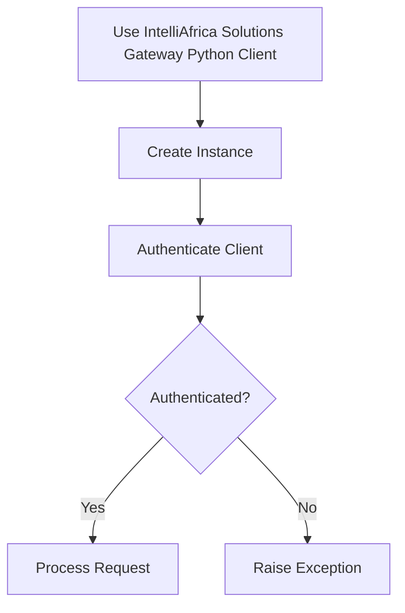

# Simple Stuff

### Usage
- import library
- create library instance using your email and password
- authenticate client
- make requests

> Unauthenticated requests will fail. Authentication does not need to be done everytime
> when one wants to make a request, it can be done once and works across all requests.

### Sample Code
```python
from intelli_gateway.gateway_client import GatewayClient

client = GatewayClient("email", "password")

# Authenticate Client
client.authenticate()

# Get Account Information
client.account_information()

# Send single sms
client.send_sms(message="Hi. How are you?", receiver="263XXXXXXXXX", sender_id="Tumai")

# Send bulk sms
client.send_bulk_sms(message="Hi. How are you?", receivers=["263XXXXXXXXX", "263XXXXXXXXX"], sender_id="Tumai")

# Send Email
client.send_email(body="Hi. How are you?", setting_id="UUID", receiver_email="email", subject="Greetings")

# Send Bulk Emails
client.send_bulk_email(body="Hi. Hello everyone. We are testing messaging!", setting_id="UUID", recipients=["me@gmail.com", "i@gmail.com"], subject="Testing Tumai")
```

### Process Flow

